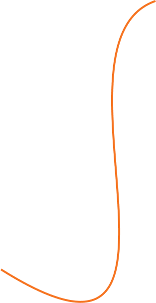

# CogitarePathWebsite
## Resumo
O site da Cogitare Path foi produzido com o intuito de informar mais sobre a empresa, como o slogan, a missão visão e valores e os membros, além de apresentar os projetos que foram desenvolvidos pela própria. 

## Protótipo 

* Apresenta o básico sobre o jogo mais recente, como nome e sinopse.


<br>
<br>
<br>

* Apresenta o slogan da empresa e a missão, visão e valores.


<br>
<br>
<br>

* Apresenta um pouco mais sobre o jogo em desenvolvimento, apresentando a sinopse e um pouco de como é o ambiente do jogo


<br>
<br>
<br>

* Apresenta os membros da empresa


<br>
<br>
<br>

* Um local onde pode ser visto nossas redes sociais, e pode entrar em contato a partir de um formulário


## Produção

A o site foi feito em apenas um arquivo HTML, a estilização foi feita com o CSS, e algumas funcionalidades foi adicionadas com JavaScript

### HTML

#### Header
* Usado para criar a barra de navegação onde contém o nome da empresa, links para navegar pela página foi configurado para acompanhar a rolagem do site  
```html
 <header class="header">
        <div id="menu-line">
            <h2 class="headerText" id="businessName">Cogitare Path</h2>
            <input type="checkbox" id="menu-button">
            <label for="menu-button" class="menu">
                <div class="linha"></div>
                <div class="linha"></div>
                <div class="linha"></div>
            </label>
        </div>
        <div class="rightSideText">
            <a class="headerText" href="#home">Home</a>
            <a class="headerText" href="#sobre">Sobre</a>
            <a class="headerText" href="#lancamentos">Lançamentos</a>
            <a class="headerText" href="#equipe">Time</a>
            <a class="headerText" href="#footer">Fale Conosco</a>
        </div>
    </header>
```

#### Home 
* Parte inicial do site tem o objetivo de cobrir toda a a altura da tela 

```html
<div class="topBackground" id="home">
        <div id="colorOverlay">
            <div class="gameInfo">
                <p id="gameName">Projeto A.G.I.R.O.</p>

                <p id="gameDesc">Luiza Koga viveu seus 22 anos de vida em um bunker, escondida de um perigo
                    desconhecido. Após se tornar a única restante ali, se vê obrigada a sair e se arriscar na
                    superfície, um mundo devastado por uma espécie de lodo preto misterioso. Explore a superfície,
                    descubra o que aconteceu com a cidade de Boa Saudade e encontre uma saída. E o mais importante, não
                    deixe que as ameaças te levem à insanidade.</p>
            </div>
        </div>
    </div>
```

| Site Computador | Site Responsivo |
| --- | --- |
|  |  |

#### MVV
* Usado para apresentar nosso slogan e nossa missão, visão e valores
* Para a criação das caixas do mvv foi utilizados IDs para cada um e uma Classe para definir um padrão
  
```html
    <section class="MVVBackground" id="sobre">
        
        

        <div id="slogan">Pensar diferente é superar o impossível</div>

        <div id="MVVSection">

            <div id="mission" class="MVVTitle">
                <p class="MVVType">Missão</p>
                <p class="MVVDescription">Proporcionar por meio da imersão, a reflexão.</p>
            </div>
            <div id="vision" class="MVVTitle">
                <p class="MVVType">Visão</p>
                <p class="MVVDescription">Ser referência na criação de jogos com pensamento crítico e filosófico.</p>
            </div>
            <div id="values" class="MVVTitle">
                <p class="MVVType">Valores</p>
                <p class="MVVDescription">Valorizar o respeito e trabalho em equipe,
                    proporcionando boas experiências para o jogador.</p>
            </div>
        </div>

    </section>
```

| Site Computador | Site Responsivo |
| --- | --- |
|  |  |

#### Lançamentos

* Para criar o efeito colorido do fundo foram criados esferas de varias cores e colocado uma camada de blur em cima.
* O texto foi alinhado com Justify para ficar em formato justificado.  

```html
    <section class="areaLancamentos">

        <div class="circle" id="laranja"></div>
        <div class="circle" id="azul"></div>
        <div class="circle" id="roxo"></div>
        <div id="rosa"></div>
        <div id="fundo">
            <div id="textoLancamentos">
                <p class="titulo">Lançamentos</p>
                <div class="align-center">
                    <p class="nomeLanc">Projeto  A.G.I.R.O.</p>
                    <p id="descricaoLancamentos">Luiza Koga viveu seus 22 anos de vida em um bunker, escondida de um
                        perigo
                        desconhecido. Após se tornar a única restante ali, se vê obrigada a sair e se arriscar na
                        superfície, se deparando com um mundo devastado por uma espécie de lodo preto.
                        Fazem 25 anos desde o dia em que essa substância destruiu, deprimiu e transformou o mundo em um
                        cenário de uma tragédia. Este dia, conhecido como “O dia da Queda”, foi resultado de um
                        experimento
                        científico falho, da vontade de entender algo do qual não queria ser compreendido.
                        Presa na cidade de Boa Saudade, local de origem e o centro do problema, Luiza precisa descobrir
                        a
                        verdade por trás disso tudo e fugir com vida. Enfrentando em sua jornada, criaturas originadas a
                        partir do lodo, formadas principalmente pelo medo de suas vítimas.
                        Explore a superfície, descubra o que aconteceu com a cidade de Boa Saudade e encontre uma saída.
                        E o
                        mais importante, não deixe que as ameaças te levem à insanidade.</p>
                </div>
            </div>

            <div id="secaoImagens">
                <div id="img-align">
                    <div id="img1" class="lancamentosImagens"></div>
                    <div id="imgContainer">
                        <div id="img2" class="lancamentosImagens"></div>
                        <div id="img3" class="lancamentosImagens"></div>
                    </div>
                </div>
                <div id="img4" class="lancamentosImagens"></div>
            </div>
        </div>
    </section>

```

| Site Computador | Site Responsivo |
| --- | --- |
|  |  |


#### Equipe

* As fotos foram colocadas em uma grid feita para ficar 3 em cada linha

```html


    <section id="equipe">
        <p class="titulo">Nossa equipe</p>
        <div id="lista">
            <div class="membros">
                
                <p class="nome">Daniel Carvalho</p>
            </div>

            <div class="membros">
                
                <p class="nome">Christian Varandas</p>
            </div>
            <div class="membros">
                
                <p class="nome">Alex C. de Oliveira</p>
            </div>
            <div class="membros">
                
                <p class="nome">Guilherme H.</p>
            </div>
            <div class="membros">
                
                <p class="nome">Maria Eduarda</p>
            </div>

            <div class="membros">
                
                <p class="nome">Gabriel Gaudí</p>
            </div>
        </div>
    </section>

```

| Site Computador | Site Responsivo |
| --- | --- |
|  |  |


#### footer

* Foi usado um link que direciona para o instagram da empresa.
* Foi criado um formulário onde pode ser colocado o nome, email e a mensagem que deseja ser passada para a empresa 

```html
<footer id="footer">
        <div id="faleConosco">
            <h1 id="faletext">Fale Conosco</h1>
            <hr>
            <table id="faleSpace">
                <tr>
                    <td>
                        
                    </td>
                    <td>
                        <h3 class="subtitle">Cogitare Path</h3>
                        <p class="description">Rua Harmonia, 77 - São Paulo - SP</p>
                    </td>
                </tr>
                <tr>
                    <td>
                        
                    </td>
                    <td>
                        <h3 class="subtitle">E-mail</h3>
                        <p class="description">contato.cogitarepath@gmail.com</p>
                    </td>
                </tr>
                <tr>
                    <td>
                        
                    </td>
                    <td>
                        <h3 class="subtitle">Telefone</h3>
                        <p class="description">(11) 3429-7174</p>
                    </td>
                </tr>
            </table>
            <h2 id="socialText">Redes Sociais</h2>
            <a href="https://www.instagram.com/cogitarepath/"></a>
            <a href=""></a>

        </div>
        <form id="formCont">
            <div id="align">
                <p class="textForm">Nome</p>
                <input type="text" name="nome" class="boxStyle" id="nome" placeholder="Digite seu nome">
                <p class="textForm">E-mail</p>
                <input type="email" name="email" class="boxStyle" id="email" placeholder="Digite seu E-mail">
                <p class="textForm">Mensagem</p>
                <textarea name="descrição" class="boxStyle" id="mensagem" placeholder="Digite sua Mensagem"></textarea>
                <input type="button" value="Enviar" id="buttonStyle">
            </div>
        </form>
    </footer>
```

| Site Computador | Site Responsivo |
| --- | --- |
|  |  |


